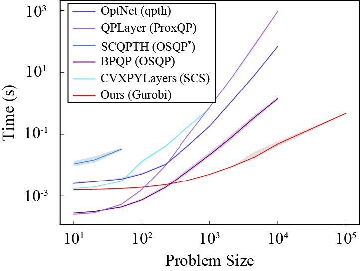

## dQP
<b>Differentiation Through Black-Box Quadratic Programming Solvers</b> [<a href="https://arxiv.org/pdf/2410.06324">Paper</a>] <br> 
<a href="https://cwmagoon.github.io/">Magoon<sup>\*</sup></a>, <a href="https://563925743.github.io/">Yang<sup>\*</sup></a>, <a href="https://noamaig.github.io/">Aigerman</a>, <a href="https://shaharkov.github.io/">Kovalsky</a><br>
Accepted. <i>NeurIPS (2025)</i>

<p align=center>
  
  <span style="display:inline-block; width: 100px;"></span> <!-- Spacer element -->
  
</p>

## Introduction

dQP is a modular framework for differentiating the solution to a quadratic programming problem (QP) with respect to its parameters, enabling the seamless integration of QPs into machine learning architectures and bilevel optimization. 
dQP supports <u>over 15 state-of-the-art QP solvers</u> by attaching a custom PyTorch layer to the open-source QP interface [[qpsolvers]](https://github.com/qpsolvers/qpsolvers).
It solves problems of the form,

<p align="center">

</p>

and is used as in the following example which uses QP solver Gurobi and sparse symmetric indefinite linear solver [[QDLDL]](https://github.com/osqp/qdldl-python),

```python
# import dQP and a tool to load example differentiable parameters
from dqp import dQP
from dqp.sparse_helper import initialize_torch_from_npz

# initialize dQP and parameters
settings = dQP.build_settings(solve_type="sparse",qp_solver="gurobi",lin_solver="qdldl")
dQP_layer = dQP.dQP_layer(settings=settings)
P,q,C,d,A,b = initialize_torch_from_npz("experiments/diagnostic/data/cross.npz")

# == solve QP ==
z_star,lambda_star,mu_star,_,_ = dQP_layer(P,q,C,d,A,b)

# == form a scalar loss and differentiate ==
z_star.sum().backward()

print(z_star) # optimal point $$z^*$$
print(d.grad) # gradient (w.r.t. d)
```
<br>

The key mathematical structure we use to aid modularity is the special polyhedral geometry of a QP. 
This is illustrated below, where a QP is <u>locally</u> equivalent to a purely equality constrained problem, <i>i.e.</i>, both their solutions and derivatives match.

<p align="center">

</p>


## Installation

### Install as a Package (Recommended)

The easiest way to use dQP is to install it as a Python package:

```bash
# Clone the repository
git clone https://github.com/your-org/dQP.git
cd dQP

# Install with pip (editable mode for development)
pip install -e .

# Install with OSQP solver support
pip install -e ".[osqp]"

# Install with all supported solvers
pip install -e ".[full]"
```

### Manual Environment Setup

Alternatively, you can set up the environment manually:

```bash
conda create -y --name dQP python=3.9
conda activate dQP
pip install torch==2.3.0+cpu -f https://download.pytorch.org/whl/torch_stable.html scipy numpy qpsolvers 
pip install clarabel cvxopt daqp ecos gurobipy highspy mosek osqp piqp proxsuite qpalm quadprog scs 
pip install qdldl pypardiso 
pip install torch_geometric torch_scatter torch_sparse -f https://data.pyg.org/whl/torch-2.3.0+cpu.html
```

This includes PyTorch, open-source python interfaces to various QP and linear solvers, and tools for sparsity. Some QP solvers such as Gurobi are commercial, but offer [[academic licenses]](https://www.gurobi.com/academia/academic-program-and-licenses/). 
Experiment-specific packages are detailed in the experiment section.

## Quick Start with OSQP

Here's a simple example using the OSQP solver:

```python
import torch
import numpy as np
from scipy.sparse import csc_matrix

from dqp import dQP
from dqp.sparse_helper import csc_scipy_to_torch

# Define a simple QP: minimize x1^2 + x2^2 s.t. x1 + x2 >= 1, x >= 0
P = csc_matrix(np.array([[2.0, 0.0], [0.0, 2.0]]))
q = np.array([0.0, 0.0])
C = csc_matrix(np.array([[-1.0, -1.0], [-1.0, 0.0], [0.0, -1.0]]))
d = np.array([-1.0, 0.0, 0.0])

# Convert to PyTorch tensors
P_torch = csc_scipy_to_torch(P)
q_torch = torch.tensor(q, dtype=torch.float64, requires_grad=True)
C_torch = csc_scipy_to_torch(C)
d_torch = torch.tensor(d, dtype=torch.float64, requires_grad=True)

# Build settings with OSQP solver
settings = dQP.build_settings(
    solve_type="sparse",
    qp_solver="osqp",
    lin_solver="scipy SPLU",
)

# Create layer and solve
layer = dQP.dQP_layer(settings=settings)
x_star, lambda_star, mu_star, _, _ = layer(P_torch, q_torch, C_torch, d_torch)

# Backpropagate
x_star.sum().backward()
print(f"Solution: {x_star.detach().numpy()}")  # [0.5, 0.5]
print(f"Gradient w.r.t. d: {d_torch.grad.numpy()}")
```

For more examples, see `examples/osqp_example.py`.

## Options

While dQP described in the snippet above suppresses default options, dQP has the following tunable settings.

|          Option          |                                                  Meaning                                                   |
|:------------------------:|:----------------------------------------------------------------------------------------------------------:|
|        qp_solver         | QP solver (supported by [[qpsolvers]](https://github.com/qpsolvers/qpsolvers?tab=readme-ov-file#solvers)). |
|        lin_solver        |                              Linear solver for the derivative (algorithm 1).                               |
|        solve_type        |                                       Dense or sparse (CSC format).                                        |
|         eps_abs          |                            Absolute tolerance on feasibility, optimality, etc.                             |
|         eps_rel          |                                            Relative tolerance.                                             |
|        eps_active        |                             Tolerance to decide the active set of constraints.                             |
|      dual_available      |                    Assert whether a given solver outputs duals, if not, solve for them.                    |
|  normalize_constraints   |                     Normalize each row of the constraints, so residuals are distances.                     |
|      refine_active       |                                Use heuristic active set refinement (Fig. 7)                                |
| warm_start_from_previous |               Save previous solution and use to warm-start (useful in bilevel optimization)                |
|       omp_parallel       |                        Use a simple parallel for loop for the forward over batches.                        |
|       empty_batch        |                            Include an empty batch dimension, even for batch 1.                             |
|    qp_solver_keywords    |                                     Additional keywords for qpsolvers.                                     |
|         verbose          |                                      Display additional information.                                       |
|           time           |                                              Display timings.                                              |
|        check_PSD         |                      Verify that Q is positive semi-definite (dense only), is costly.                      |

<b> Which solver do I choose for my problem? </b> First, we suggest perusing open-source benchmarks and the basic classes of QP solver. 
For more information, we include a simple diagnostic tool which iterates through available QP solvers and times the forward/backward solves of your example QP (Fig. 6).

## Experiments

We provide the code for our experiments in the experiments folder, including some additional directions on running them at the following:

* [Benchmark Experiment](./experiments/mega_test/README.md) 
* [Sudoku Experiment](./experiments/sudoku/README.md)
* [Geometry Experiment](./experiments/geometry/README.md)

<details>
  <summary>For these experiments, additional packages are required for setup or visualization:
</summary>

    pip install optnet qpth cvxpylayers proxsuite
    
    pip install matplotlib tensorboard pandas
    
    pip install setproctitle
    
    pip install libigl polyscope shapely robust_laplacian torchvision==0.18
    conda install -c conda-forge ffmpeg
</details>


